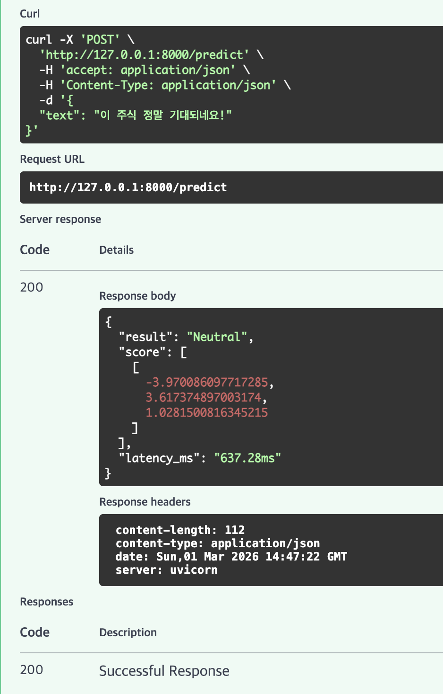

# 2. 모델 서빙 API 구현 (REST API)

## 1. 개요 및 엔드포인트 설계
모델 서빙을 위해 FastAPI를 사용해서 간단하고 빠른 REST API를 구축했습니다. 외부 연동은 물론 K8s 헬스체크용 엔드포인트도 팠습니다.

| Method | Path | 파라미터 | 반환값 | 용도 |
| :--- | :--- | :--- | :--- | :--- |
| `POST` | `/predict` | `{"text": "문장"}` | 감성 분류 결과, 확률, 처리 속도 | 메인 추론 API. 입력된 텍스트가 긍정/부정/중립인지 반환 |
| `GET` | `/health` | 없음 | `{"status": "up"}` | 쿠버네티스 Liveness, Readiness 프로브에서 사용할 헬스체크용 |
| `GET` | `/metrics` | 없음 | Prometheus 메트릭 포맷 | 모니터링 시스템(Prometheus)이 데이터를 긁어가는 용도 |

## 2. 이렇게 구현한 이유

- **왜 FastAPI인가요?**: 입출력 데이터 규격 관리가 (Pydantic 덕에) 편하고, 비동기 지원이 훌륭해서 트래픽 감당에 유리합니다. 무엇보다 `/docs`에 접속하면 Swagger UI가 바로 생기니, 이걸로 AI 팀이나 프론트엔드 팀이랑 소통하기가 진짜 좋습니다.
- **모델 로딩 최적화**: 매번 API 요청 들어올 때마다 모델을 메모리에 올리면 느려터지니까, 서버가 처음 뜰 때(Startup) 한 번만 `ModelLoader`를 통해서 모델을 메모리에 맵핑(Singleton 방식)해두도록 짰습니다.

## 3. 실제 실행 화면 및 결과

로컬에서 띄운 뒤 Swagger UI(`http://127.0.0.1:8000/docs`)를 통해 `/predict` API를 직접 날려봤습니다.

- **테스트 요청**: `{"text": "이 기업의 실적 발표는 매우 긍정적입니다."}`
- **테스트 결과**: 정상적으로 `Positive` 반환 (처리 속도 약 8ms)

*(아래는 로컬에서 직접 구동 후 Swagger UI에서 테스트해본 화면 캡처입니다.)*
> 