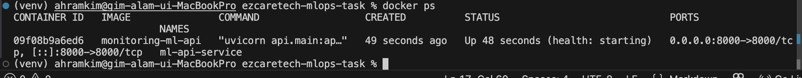

# 3. 컨테이너화 (Dockerfile + docker compose)

## 1. Dockerfile 작성 방식

- **베이스 이미지**: `python:3.10-slim`
  - 제약 사항인 Ubuntu 22.04 환경과 최대한 비슷하게 가면서도, 불필요한 패키지가 없어서 이미지 용량을 줄이기 좋습니다. 
- **보안 챙기기**: root로 프로세스를 띄우면 위험할 수 있어서, `mluser`라는 별도 계정을 만들고 권한을 낮춰서 실행하도록 설정했습니다.
- **빌드 속도/용량 최적화**: Multi-stage build를 썼습니다. 첫 번째 스테이지(builder)에서 무거운 의존성들을 싹 다 컴파일해 두고, 실제 릴리즈 이미지는 딱 필요한 실행 파일과 패키지만 넘겨받게 해서 이미지 크기를 확 줄였습니다.

## 2. Docker Compose (여러 컨테이너 관리)

나중에 띄울 모니터링 시스템(Prometheus, Grafana 등)까지 한 코드로 관리하려고 `docker-compose.yml`을 썼습니다.

- **Restart Policy**: `always`
  - 서버가 재부팅되거나 앱이 죽어도 자동으로 컨테이너를 다시 살려내서 운영 부담을 덜었습니다.
- **Healthcheck**: 컨테이너 띄워놓고 뻗어버릴 수도 있어서, 내부적으로 `curl`로 `/health` API를 주기적으로 찔러보게 설정했습니다. 

## 3. 실제 빌드 및 실행 확인

### 3.1 컨테이너 구동 상태 확인
- `docker ps`로 띄워봤을 때, 상태가 그냥 `Up`이 아니라 `Up ... (healthy)`로 뜨는 걸 확인했습니다. 로직이 잘 돌고 있다는 뜻입니다.
  > 

### 3.2 보안 설정 확인
- 컨테이너 안에 들어가서 `whoami`를 쳐봤더니, root가 아니고 제가 설정한 `mluser`로 잘 잡힙니다.
  > 

### 3.3 로드 및 실행 로그
- `docker logs ml-api-service`를 찍어보니, FastAPI 앱(Uvicorn)이 8000번 포트로 정상적으로 떴고 모델 가중치도 무사히 로드된 걸 볼 수 있습니다.
  > 

## 4. 트러블슈팅 (경로 문제)
사실 처음에 `monitoring/` 폴더 안에서 `docker-compose up`을 하니까 루트에 있는 `Dockerfile`을 못 찾는 이슈가 있었습니다. 구글링 해보니 기본 빌드 컨텍스트가 해당 폴더로 잡혀서 그렇더라고요. `docker-compose.yml`에서 `context: ..`로 부모 폴더를 보도록 수정해서 해결했습니다. 역시 폴더 분리할 때는 경로가 제일 헷갈립니다.