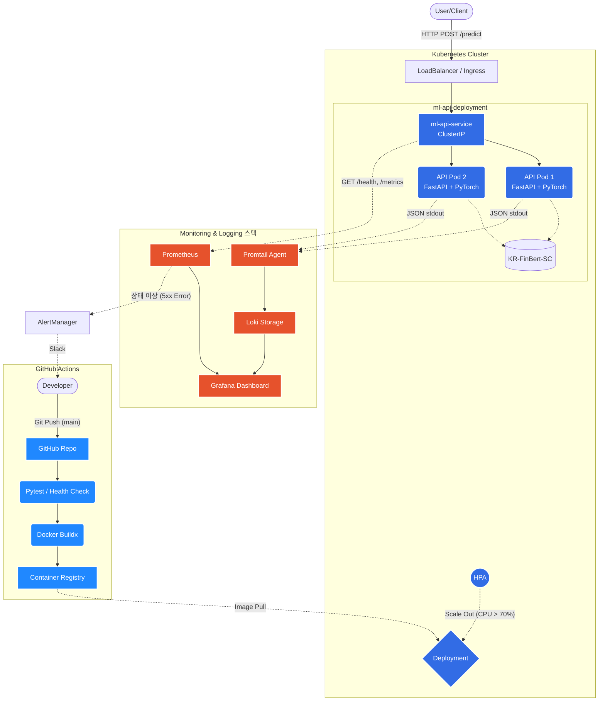

# 12. 전체 시스템 아키텍처 설계도
제약 사항(외부 SaaS 사용 금지, 인력 부재, K8s + Docker 필수)을 반영하여 "Zero-Ops와 완전 자동화"에 초점을 맞춘 전체 MLOps 및 서빙 아키텍처입니다.

## 아키텍처 다이어그램 (Mermaid)

아래 코드를 복사하여 [Mermaid Live Editor](https://mermaid.live/) 에 붙여넣으면 깔끔한 시스템 구성도로 시각화할 수 있습니다. (Draw.io 등에서도 바로 붙여넣어 생성 가능합니다.)

### 흐름 부연 설명
1. **CI/CD 파이프라인**: 5명의 개발자가 코드를 `main`에 올리면 깃허브 액션이 `pytest`를 돌리고 통과하면 도커 이미지를 말아서 배포 시킵니다.
2. **트래픽 서빙**: 유저의 추론 요청이 K8s 클러스터의 `ml-api-service`를 타고 들어가고, HPA의 감시 하에 CPU 부하가 높아지면 스케일아웃이 일어납니다.
3. **통합 관측성**: 메트릭(Prometheus)과 텍스트 로그(Promtail -> Loki) 데이터가 전부 Grafana 하나로 모이도록 설계했습니다. 장애 시 대시보드만 띄워두고 분석이 가능합니다.
